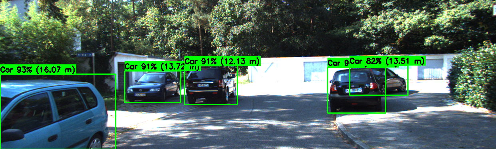

# 3D Object Perception using YOLOv8 & Stereo Vision

This project implements a 3D perception system by combining a state-of-the-art object detector (YOLOv8) with classic stereo vision (OpenCV). The system detects vehicles, pedestrians, and cyclists in 2D images and simultaneously estimates their real-world distance from the camera.

The model is trained and tested on the [KITTI Object Detection Dataset](https://www.kaggle.com/datasets/c/kitti-object-detection-challenge).

## Demo

Here is an example of the final output. The system processes the left and right stereo images to produce a single result with 2D bounding boxes, confidence scores, and the estimated 3D distance (in meters) for each object.



## Project Goal

The goal is to create a complete perception pipeline that moves beyond simple 2D detection. By fusing two different techniques, we can answer not only **"What is that?"** (from YOLO) but also **"Where is it?"** (from stereo vision). This is a fundamental task for any autonomous system, such as a self-driving car or a delivery robot.

## Key Features

* **2D Object Detection:** A YOLOv8n model was fine-tuned on the KITTI dataset to detect `Car`, `Pedestrian`, and `Cyclist` classes.
* **3D Depth Estimation:** A dense depth map is calculated from the stereo image pair (`image_2` and `image_3`) using OpenCV's `StereoSGBM` (Semi-Global Block Matching) algorithm.
* **Data Pipeline:** Includes scripts to:
    1.  Parse and convert KITTI's 2D label files into the YOLO `.txt` format for training.
    2.  Read and parse camera calibration files (`.txt`) to extract the focal length (`f`) and baseline (`B`).
* **Result Fusion:** The 2D bounding boxes from the detector are overlaid on the calculated depth map to find the median depth value for each detected object, providing a robust distance estimate.

## Model Performance

The fine-tuned YOLOv8n model was trained for 25 epochs and achieved the following performance on the validation set:

| Class | mAP50 (Accuracy) | mAP50-95 (Strict Accuracy) |
| :--- | :--- | :--- |
| **Car** | **94.6%** | 73.8% |
| **Pedestrian** | 74.1% | 40.9% |
| **Cyclist** | 81.1% | 49.8% |
| **All Classes** | **83.3%** | **54.8%** |

## Technical Stack

* **Python 3.11**
* **Ultralytics (YOLOv8)**: For object detection training and inference.
* **OpenCV-Contrib**: For stereo vision (`StereoSGBM`) and image processing (`cv2`).
* **PyTorch**: The backend framework for YOLOv8.
* **NumPy**: For numerical operations on depth maps.
* **Matplotlib**: For visualizing results.
* **Kaggle Notebooks**: For the GPU-accelerated training environment (Tesla T4).

## How to Use This Repository

### 1. Quick Inference (Recommended)

1.  Download the trained model `best.pt` from this repository.
2.  Add the `best.pt` file to your notebook or project.
3.  Load the model:
    ```python
    from ultralytics import YOLO
    
    # Load your trained model
    model = YOLO('path/to/your/best.pt')
    
    # Run prediction
    results = model.predict('your_image.png')
    ```

### 2. Re-running the Full Project

This project is best run in a Kaggle Notebook environment to easily access the dataset.

1.  **Clone the Repository:**
    ```bash
    git clone https://github.com/Gorachand2501/yolov8-object-detection-and-stereo-depth.git
    ```
2.  **Upload to Kaggle:**
    * Upload the `.ipynb` file to a new Kaggle Notebook.
    * Add the [KITTI Object Detection Dataset](https://www.kaggle.com/datasets/c/kitti-object-detection-challenge) as input data.
    * Enable the **GPU Accelerator** (T4 or P100).
3.  **Run the Notebook:**
    * **To re-train:** Run all cells from top to bottom. This will execute the data conversion, train the model, save `best.pt`, and run the final depth estimation.
    * **To run inference only:**
        1.  Upload your pre-trained `best.pt` file as a new Kaggle Dataset.
        2.  Add this new dataset as an input to your notebook.
        3.  **Skip the training cell (Cell 6)**.
        4.  In the final cells, change the model path to point to your input file:
            ```python
            # Original path
            # model = YOLO('/kaggle/working/runs/detect/yolov8n_kitti/weights/best.pt')
            
            # New path
            model = YOLO('/kaggle/input/your-model-dataset-name/best.pt')
            ```
